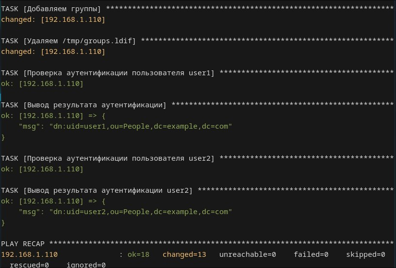

# OpenLDAP Ansible Playbook

## Описание
Этот плейбук Ansible разворачивает OpenLDAP сервер на Ubuntu LTS.  
Он выполняет следующие действия:

- Устанавливает OpenLDAP и необходимые утилиты (`slapd`, `ldap-utils`)
- Установливает и удаляет утилиты для работы playbook (`debconf-utils`)
- Настраивает домен и организацию LDAP
- Задаёт пароль администратора LDAP
- Создаёт организационные единицы (OU):
  - `People`
  - `Groups`
- Добавляет пользователей:
  - `user1`
  - `user2`
- Создаёт группы:
  - `group1`
  - `group2`

### Структура LDAP после выполнения playbook

```
dc=example,dc=com
│
├── ou=People
│   ├─ uid=user1
│   └── uid=user2
│
└── ou=Groups
├── cn=group1 (memberUid: user1)
└── cn=group2 (memberUid: user2)
```

### Файл vars.yml

Файл `vars.yml` содержит все переменные конфигурации LDAP:
> Изменяя этот файл, можно добавлять новых пользователей, группы или менять параметры домена, организации и пароля администратора, не меняя сам playbook.

```yaml
ldap_domain: "example.com"
ldap_org: "ExampleOrg"
ldap_admin_pass: "adminpass"
ldap_base_dn: "dc=example,dc=com"

users:
  - uid: user1
    cn: "User One"
    sn: User1
    uidNumber: 10001
    gidNumber: 5001
    homeDirectory: "/home/user1"
    loginShell: "/bin/bash"
    password: "user1pass"
  - uid: user2
    cn: "User Two"
    sn: User2
    uidNumber: 10002
    gidNumber: 5002
    homeDirectory: "/home/user2"
    loginShell: "/bin/bash"
    password: "user2pass"

groups:
  - cn: group1
    gidNumber: 5001
    members:
      - user1
  - cn: group2
    gidNumber: 5002
    members:
      - user2
```

---

## Запуск

1. Склонировать репозиторий:

```bash
git clone https://github.com/Hestci/ldap-setup.git
cd ldap-setup
```

2. Передать SSH-ключи на сервер для авторизации:

```bash
ssh-copy-id 192.168.1.110
```

3. Настроить `hosts.ini`:

```ini
[ldap-server]
192.168.1.110 ansible_user=hest
```

4. Запустить playbook и ввести пароль sudo:

```bash
ansible-playbook -i hosts.ini ldap-setup.yml --ask-become-pass
```

5. Проверка успешного добавления пользователей:

```text
TASK [Проверка аутентификации пользователя user1] ***************************************
ok: [192.168.1.110]

TASK [Вывод результата аутентификации] **************************************************
ok: [192.168.1.110] => {
    "msg": "dn:uid=user1,ou=People,dc=example,dc=com"
}

TASK [Проверка аутентификации пользователя user2] ***************************************
ok: [192.168.1.110]

TASK [Вывод результата аутентификации user2] ********************************************
ok: [192.168.1.110] => {
    "msg": "dn:uid=user2,ou=People,dc=example,dc=com"
}
```

> Если эти задачи прошли успешно, OpenLDAP настроен корректно и пользователи могут аутентифицироваться.

